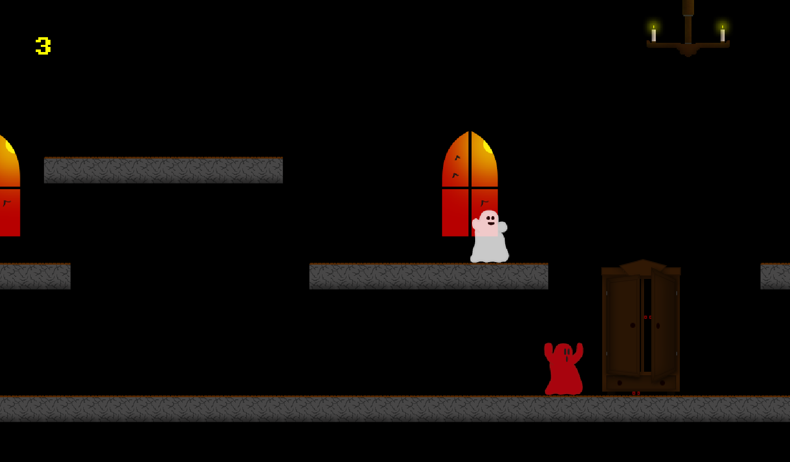

# Le-manoir-de-Mr-Barry

## Objectif du projet

L'idée de ce projet est tout simplement la découverte de Kaboom.js. 

Créer mon premier jeu vidéo.

## Contenu 

- 5 niveaux 
- 1 boss

**(Les trois premiers niveaux sont dans le même état d'esprit. Le quatrième niveau à pour objectif de créer un second souffle via sa musique et la stratégie pour résoudre celui-ci. Le cinquième niveau c'est l'affrontement avec le boss du jeu)** 

## Bilan

Le projet m'a permis d'observer, de comprendre, d'analyser et de tester cette librairie afin d'avoir un avis dessus. 

Ce premier jeu vidéo m'a permis "d'entrevoir" la création de jeu vidéo et nottament l'importance des sprites, sons, animations...

Ayant créé la totalité des sprites (décors, personnages...), j'ai appris pas mal de choses sur le logiciel "PhotoShop".

## Bonus

J'ai enregistré les bruitages (clef, saut, levier, mur cassé...) via l'enregistreur de son de mon portable. Par conséquent 90% des bruitages ont été faits par ma bouche. Faire le jeu en ayant connaissance de ça permet de rendre la découverte bien plus marrante, c'est cadeau ! :P 

La musique du niveau 4 est celle de la maison hantée de Disneyland Paris.

  
